# Лабораторная работа №5. Облачные базы данных. Amazon RDS, DynamoDB

## Цель работы

Целью работы является ознакомиться с сервисами Amazon RDS (Relational Database Service) и Amazon DynamoDB, а также научиться:

- Создавать и настраивать экземпляры реляционных баз данных в облаке AWS с использованием Amazon RDS.
- Понимать концепцию Read Replicas и применять их для повышения производительности и отказоустойчивости баз данных.
- Подключаться к базе данных Amazon RDS с виртуальной машины EC2 и выполнять базовые операции с данными (создание, чтение, обновление, удаление записей - CRUD).


### Шаг 1. Подготовка среды (VPC/подсети/SG)

1. Создайте VPC (`project-vpc`) с _двумя публичными_ и _двумя приватными_ подсетями в разных зонах доступности (AZ). В данной подсети будут развернуты ваши базы данных и приложение.
   1. Для создания подсетей воспользуйтесь _мастером создания VPC_ (Create VPC -> VPC and more) в консоли AWS или используйте VPC созданную в 3 лабораторной работе.
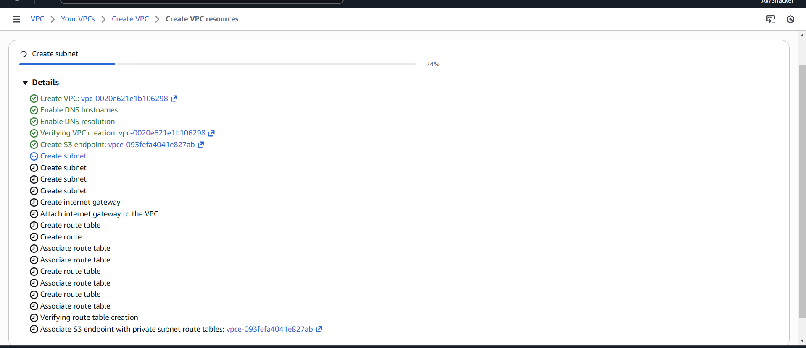
2. Создайте группу безопасности (`web-security-group`) для вашего приложения, разрешающий следующий трафик:
   - Входящий: HTTP (порт 80) от любого источника;
   - Входящий: SSH (порт 22) от вашего IP-адреса или от любого источника (для учебных целей)
   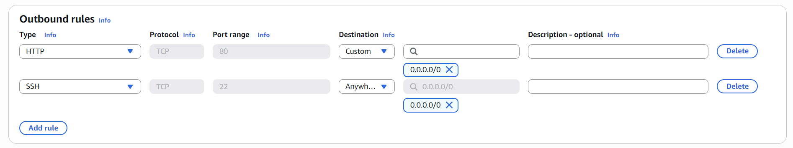
3. Создайте группу безопасности (`db-mysql-security-group`) для вашей базы данных, разрешающий следующий трафик:
   - Входящий: MySQL/Aurora (порт 3306) от `web-security-group` (т.е. только ресурсы, принадлежащие этой группе безопасности, смогут подключаться к базе данных)
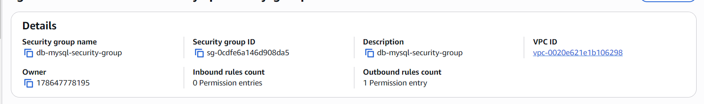
4. Измените `web-security-group`, добавив правило для исходящего трафика:
   - Исходящий: MySQL/Aurora (порт 3306) к `db-mysql-security-group` (т.е. ваше приложение сможет инициализировать соединение с базой данных).
### Шаг 2. Развертывание Amazon RDS

1. Перейдите в консоль Amazon Aurora and RDS.
2. Создайте `Subnet Group` для вашей базы данных.
   - Название: `project-rds-subnet-group`
   - Выберите созданный ранее VPC и добавьте 2 приватные подсети из 2 разных AZ.
   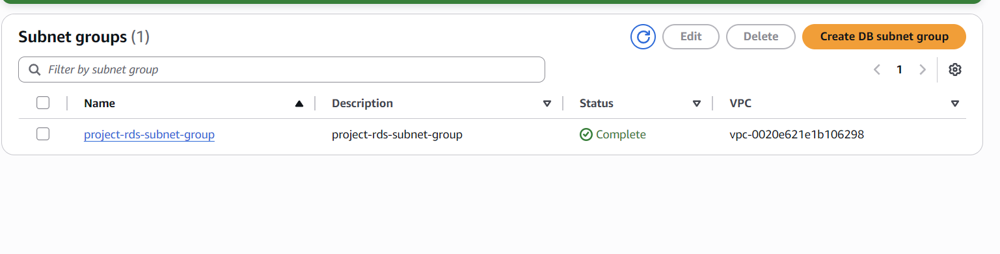

3. Создайте экземпляр базы данных Amazon RDS (Databases -> Create database).
4. В разделе `Choose a database creation method` выберите `Standard Create`. Это позволит вам настроить все параметры базы данных вручную, что полезно для учебных целей.
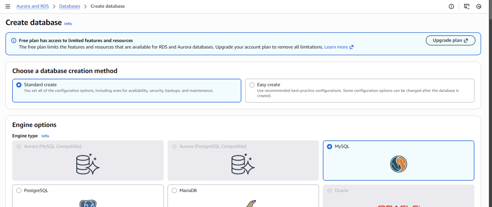
5. Выберите следующие параметры базы данных:
   - Engine type: `MySQL`
   - Version: `MySQL 8.0.42` (или последнюю доступную версию)
   - Templater: `Free tier` (так как это учебная среда)
   - Availability and durability: `Single-AZ DB instance deployment`
   - DB instance identifier (название сервера базы данных): `project-rds-mysql-prod`
   - Master username: `admin` (имя пользователя администратора базы данных)
   - _Master password_ введите и подтвердите пароль для пользователя администратора.
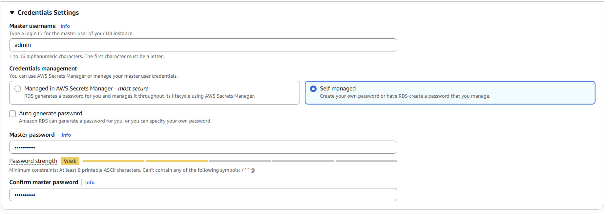
   - DB instance class: `Burstable classes (includes t classes)`, `db.t3.micro` (подходит для учебных целей)
   - Storage:
     - Storage type: `General Purpose SSD (gp3)`
     - Allocated storage: `20 GB` (минимально доступный размер для учебных целей)
     - Enable storage autoscaling: `Checked` (это позволит базе данных автоматически увеличивать размер хранилища при необходимости)
     - Maximum storage threshold: `100 GB`
     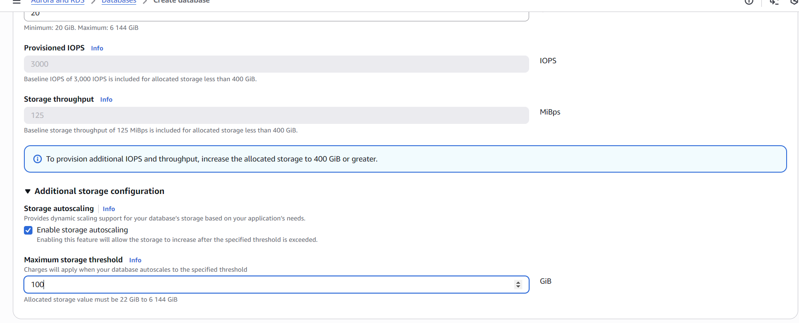
   - Connectivity (подключение)
     - Выберите `Don’t connect to an EC2 compute resource`
     - Virtual private cloud (VPC) выберите созданный ранее VPC
     - DB subnet group: выберите созданную ранее Subnet Group `project-rds-subnet-group`
     - Public access: `No` (база данных не будет доступна из интернета)
     - Existing VPC security groups: выберите созданную ранее группу безопасности `db-mysql-security-group`
     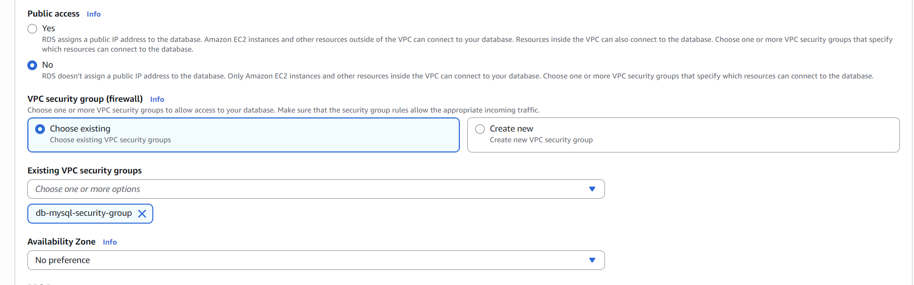
     - Availability zone: `No preference` 
   - Additional configuration
     - Initial database name: `project_db` (название базы данных, которая будет создана при инициализации)
     - Backup (Enable automated backup) поставьте галочку (_для создания read replica необходимы бэкапы_)
     - Backup (Enable encryption) снимите галочку (_для учебных целей шифрование не требуется_)
     - Maintanance (Enable auto minor version upgrade) снимите галочку (_для учебных целей автоматическое обновление не требуется_)
   - Нажмите `Create database` для создания базы данных.
   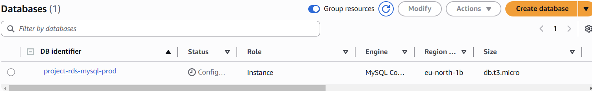
6. Дождитесь завершения создания базы данных (статус должен измениться на `Available`).
7. Скопируйте `Endpoint` вашей базы данных (он понадобится для подключения).

### Шаг 3. Создание виртуальной машины для подключения к базе данных
Создайте виртуальную машину EC2 в публичной подсети вашего VPC, чтобы использовать её для подключения к базе данных RDS.

Для виртуальной машины, используйте группу безопасности `web-security-group`, созданную ранее.

При инициализации виртуальной машины установка MySQL клиента, чтобы упростить подключение к базе данных RDS.
```bash
#!/bin/bash
dnf update -y
dnf install -y mariadb105 # Установка MariaDB/MySQL клиента (подходит и для MySQL и для MariaDB)
```
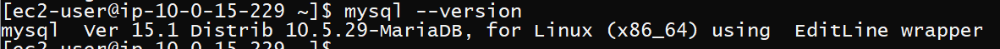
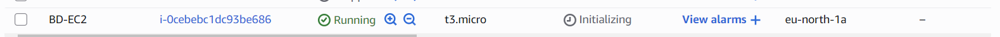

### Шаг 4. Подключение к базе данных и выполнение базовых операций
1. Подключитесь к вашей виртуальной машине EC2 по SSH.
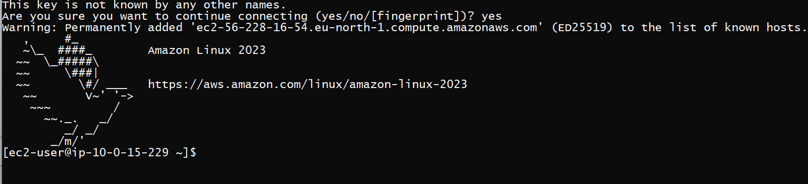
2. Подключитесь к базе данных RDS с помощью MySQL клиента:
   ```bash
   mysql -h <RDS_ENDPOINT> -u admin -p
   ```
3. Введите пароль администратора базы данных, который вы указали при создании базы данных.
   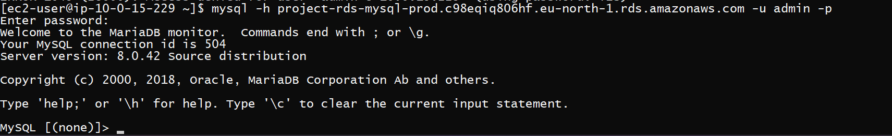
4. После успешного подключения выберите базу данных:
   ```sql
   USE project_db;
   ```
   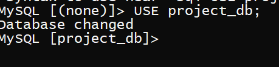
5. Создайте две таблицы. Между таблицами обязательно должна быть связь 1 ко многим (one-to-many).
   - Например: таблица `categories (id, name)` и таблица `todos (id, title, category_id, status)`, где `category_id` - внешний ключ, ссылающийся на `categories.id`.
   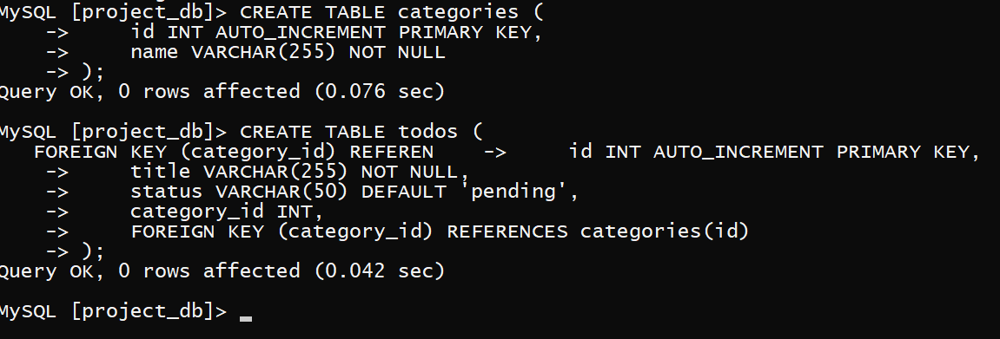
6. Вставьте несколько записей в каждую таблицу (минимум по 3 записи в каждую таблицу).
    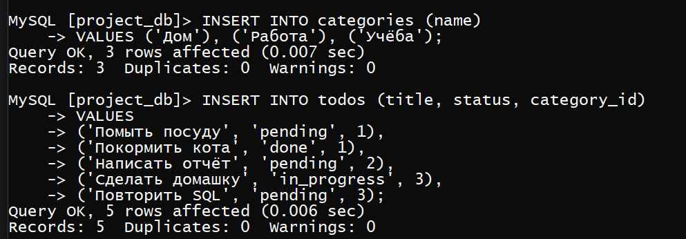
7. Выполните несколько запросов на выборку данных, включая JOIN между таблицами.
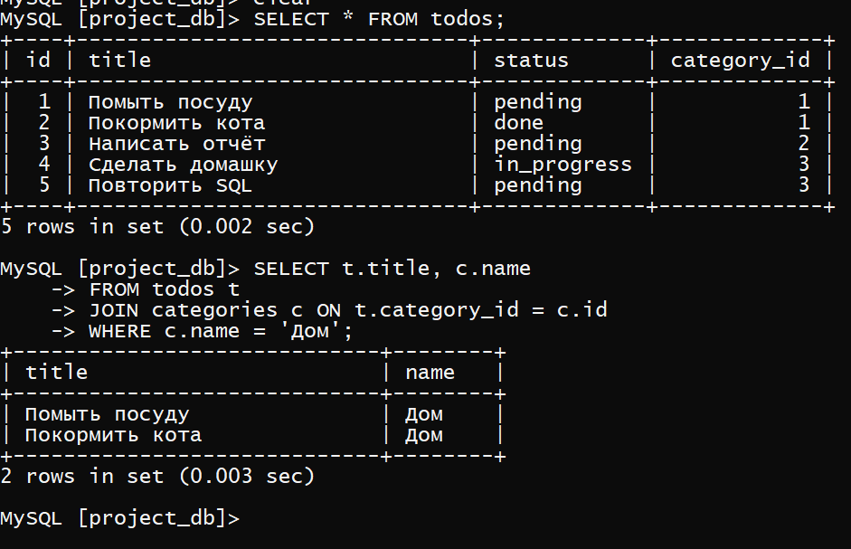

### Шаг 5. Создание Read Replica

1. Выберите базу данных RDS в консоли AWS.
2. Нажмите на кнопку `Actions` и выберите `Create read replica`.
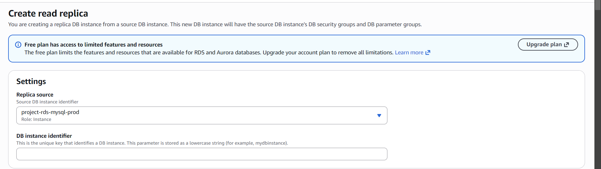
3. Укажите следующие параметры для Read Replica:
   - DB instance identifier: `project-rds-mysql-read-replica`
   - Instance class: `db.t3.micro`
   - Storage type: `General Purpose SSD (gp3)`
   - Monitoring
     - Enable Enhanced monitoring: _снимите галочку_ (для учебных целей не требуется)
   - Public access: `No`
   - VPC security groups: выберите ту же группу безопасности `db-mysql-security-group`
   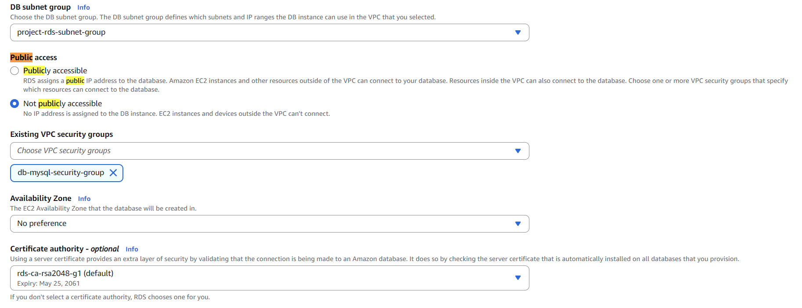
4. Дождитесь, пока реплика перейдёт в `Available`. У неё будет свой `endpoint` (_только для чтения_).
5. Подключитесь к Read Replica с вашей виртуальной машины EC2 и выполните запросы на чтение данных (SELECT) из таблиц, созданных на основном экземпляре базы данных.
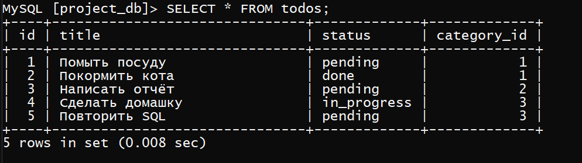
6. Попробуйте выполнить запрос на запись (INSERT/UPDATE) на реплике.
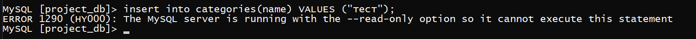

7. Перейдите на основной экземпляр базы данных и добавьте новую запись в одну из таблиц.

8. Вернитесь к подключению к Read Replica и выполните запрос на чтение.
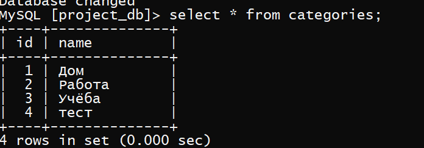

9. Объясните, зачем нужны Read Replicas и в каких сценариях их использование будет полезным.
 > Реплика полезна для backup для того, чтоб всегда была возможность поднять базу данных которая упала

### Шаг 6. Подключение приложения к базе данных

Выберите один из вариантов ниже для подключения приложения к базе данных Amazon RDS и выполнения базовых операций с данными (CRUD).

#### Шаг 6a. Развертывание CRUD приложения

1. _Разработайте и разверните_ простое веб-приложение на вашей виртуальной машине Amazon EC2, которое подключается к базе данных Amazon RDS и выполняет базовые операции с данными (создание, чтение, обновление, удаление записей - CRUD).
2. Настройте приложение таким образом, чтобы для операций записи и изменения данных использовался основной экземпляр (`master instance`), а для операций чтения - реплика для чтения (`read replica`).

> В данном задании достаточно разработать простое приложение с минимальным функционалом. Вы можете использовать любой язык программирования и фреймворк по вашему выбору.


## Контрольные вопросы

   > Что такое Subnet Group? И зачем необходимо создавать Subnet Group для базы данных?

> Какие данные вы видите? Объясните почему.

> Получилось ли выполнить запись на Read Replica? Почему?

> Отобразилась ли новая запись на реплике? Объясните почему.