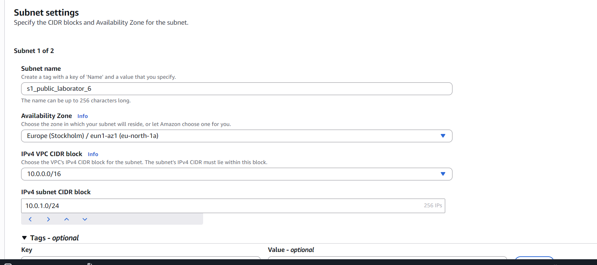
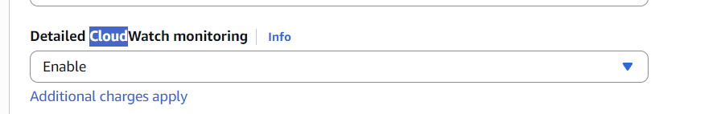
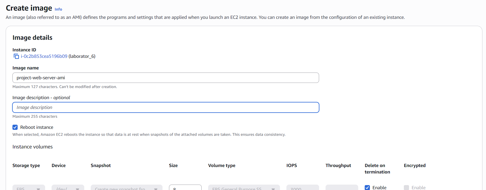
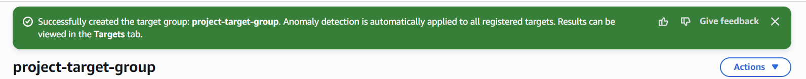
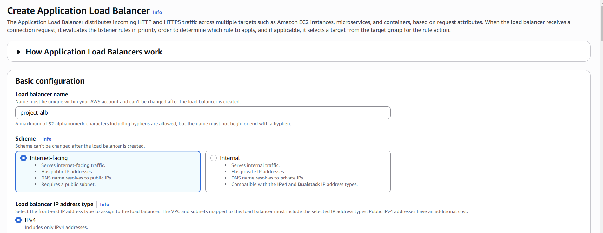
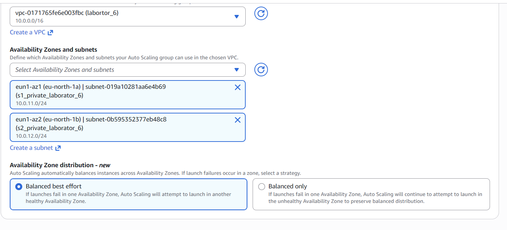

## Шаг 1. Создание VPC и подсетей  
Создайте VPC (если уже есть — используйте существующую):  
Создайте 2 публичные подсети и 2 приватные подсети в разных зонах доступности (например, us-east-1a и us-east-1b):  
CIDR-блок: 10.0.1.0/24 и 10.0.2.0/24 
 
Создайте Internet Gateway и прикрепите его к VPC.  
В Route Table пропишите маршрут для публичных подсетей:  
Destination: 0.0.0.0/0 → Target: Internet Gateway  

## Шаг 2. Создание и настройка виртуальной машины  
Запусите виртуальную машину в созданной подсети:

AMI: Amazon Linux 2  
Тип: t3.micro  
В настройках сети выберите созданную VPC и подсеть.  
Включить Enable auto-assign public IP.

В настройках безопасности создайте новую группу безопасности с правилами:

Входящие правила:  
SSH (порт 22) — источник: ваш IP  
HTTP (порт 80) — источник: 0.0.0.0/0

Исходящие правила:  
Все трафики — источник: 0.0.0.0/0

В Advanced Details -> Detailed CloudWatch monitoring выберите Enable.  
Это позволит собирать дополнительные метрики для Auto Scaling.

Дождитесь, пока Status Checks виртуальной машины станут зелёными (3/3 checks passed).

## Шаг 3. Создание AMI  
В EC2 выберите Instance → Actions → Image and templates → Create image.  
Назовите AMI, например: project-web-server-ami.  
Дождитесь появления AMI в разделе AMIs.

---

## Шаг 4. Создание Launch Template  
На основе Launch Template в дальнейшем будет создаваться Auto Scaling Group, то есть подниматься новые инстансы по шаблону.

В разделе EC2 выберите Launch Templates → Create launch template.

Укажите следующие параметры:  
Название: project-launch-template  
AMI: выберите созданную ранее AMI (My AMIs -> project-web-server-ami).  
Тип инстанса: t3.micro.  
Security groups: выберите ту же группу безопасности, что и для виртуальной машины.  
Нажмите Create launch template.

В разделе Advanced details -> Detailed CloudWatch monitoring выберите Enable.  
Это позволит собирать дополнительные метрики для Auto Scaling.

---

## Шаг 5. Создание Target Group  
В разделе EC2 выберите Target Groups → Create target group.

Укажите следующие параметры:

Название: project-target-group  
Тип: Instances  
Протокол: HTTP  
Порт: 80  
VPC: выберите созданную VPC  

Нажмите Next -> Next, затем Create target group.

---

## Шаг 6. Создание Application Load Balancer  
В разделе EC2 выберите Load Balancers → Create Load Balancer → Application Load Balancer.

Укажите следующие параметры:

Название: project-alb  
Scheme: Internet-facing.

Subnets: выберите созданные 2 публичные подсети.  
Security Groups: выберите ту же группу безопасности, что и для виртуальной машины.  
Listener: протокол HTTP, порт 80.  
Default action: выберите созданную Target Group project-target-group.

Нажмите Create load balancer.

---

## Шаг 7. Создание Auto Scaling Group  
В разделе EC2 выберите Auto Scaling Groups → Create Auto Scaling group.

Укажите следующие параметры:

Название: project-auto-scaling-group  
Launch template: выберите созданный ранее Launch Template (project-launch-template).

Перейдите в раздел Choose instance launch options.  
В разделе Network: выберите созданную VPC и две приватные подсети.

Availability Zone distribution: выберите Balanced best effort.

Перейдите в раздел Integrate with other services и выберите Attach to an existing load balancer, затем выберите созданную Target Group (project-target-group).

Таким образом мы добавляем AutoScaling Group в Target Group нашего Load Balancer-а.

Перейдите в раздел Configure group size and scaling и укажите:  
Минимальное количество инстансов: 2  
Максимальное количество инстансов: 4  
Желаемое количество инстансов: 2  

Укажите Target tracking scaling policy и настройте масштабирование по CPU (Average CPU utilization — 50% / Instance warm-up period — 60 seconds).

В разделе Additional settings поставьте галочку на Enable group metrics collection within CloudWatch, чтобы собирать метрики Auto Scaling Group в CloudWatch.

Перейдите в раздел Review и нажмите Create Auto Scaling group.

---

Шаг 8. Тестирование Application Load Balancer  
Перейдите в раздел EC2 -> Load Balancers, выберите созданный Load Balancer и скопируйте его DNS-имя.  
Вставьте DNS-имя в браузер и убедитесь, что вы видите страницу веб-сервера.  
Обновите страницу несколько раз и посмотрите на IP-адреса в ответах.

Какие IP-адреса вы видите и почему?

---

Шаг 9. Тестирование Auto Scaling  
Перейдите в CloudWatch -> Alarms, у вас должны быть созданы автоматические оповещения для Auto Scaling Group.  
Выберите одно из оповещений (например, TargetTracking-XX-AlarmHigh-...), откройте и посмотрите на график CPU Utilization.  
На данный момент график должен быть низким (около 0-1%).

Перейдите в браузер и откройте 6-7 вкладок со следующим адресом:  
http://<DNS-имя вашего Load Balancer-а>/load?seconds=60

В качестве альтернативы используйте скрипт curl.sh, указав в нём DNS-имя вашего Load Balancer-а.

Для специализации DevOps необходимо модифицировать скрипт curl.sh так, чтобы он:  
принимал параметры из командной строки: количество потоков и длительность нагрузки.  
(дополнительно) использовал ab (Apache Benchmark) или hey для создания нагрузки вместо бесконечного цикла с curl.

Вернитесь в CloudWatch и посмотрите на график CPU Utilization.  
Через несколько минут вы должны увидеть рост нагрузки.

Подождите 2-3 минуты, пока CloudWatch не зафиксирует высокую нагрузку и не создаст Alarm (будет показано красным цветом).  
Перейдите в раздел EC2 -> Instances и посмотрите на количество запущенных инстансов.

Какую роль в этом процессе сыграл Auto Scaling?

---

## Контрольные вопросы 

### 1. Что такое **image** и чем он отличается от **snapshot**? Какие есть варианты использования AMI?

- **Image (AMI — Amazon Machine Image)** — это шаблон виртуальной машины, который содержит:
  - операционную систему,
  - установленные приложения,
  - настройки конфигурации.
- **Snapshot** — это снимок тома (например, EBS volume), который сохраняет только данные диска, без полной конфигурации ОС.
- **Разница**:
  - AMI = полностью готовый шаблон для запуска инстансов.
  - Snapshot = только сохранение состояния диска.
- **Использование AMI**:
  - Быстрое развертывание новых инстансов с одинаковой конфигурацией.
  - Создание шаблона для Auto Scaling.
  - Репликация серверов между регионами.

---

### 2. Что такое **Launch Template** и зачем он нужен? Чем он отличается от **Launch Configuration**?

- **Launch Template** — это современный способ задания конфигурации инстанса:
  - AMI,
  - тип инстанса,
  - security group,
  - ключи доступа,
  - user data скрипты и др.
- **Launch Configuration** — устаревший аналог Launch Template с меньшей гибкостью.
- **Разница**:
  - Launch Template поддерживает версии, множество настроек и параметры override.
  - Launch Configuration фиксирован, нельзя изменять после создания.
- **Зачем нужен**:
  - Чтобы Auto Scaling Group могла создавать инстансы с одинаковой конфигурацией.
  - Упрощает управление и обновление конфигураций.

---

### 3. Зачем необходима и какую роль выполняет **Target Group**?

- **Target Group** — это набор инстансов (или IP), которым Application Load Balancer (ALB) направляет трафик.
- **Роль**:
  - Балансировка нагрузки между инстансами.
  - Мониторинг состояния инстансов (health checks).
  - Связь между Load Balancer и Auto Scaling Group.

---

### 4. Что такое **Default action** и какие есть типы Default action?

- **Default action** — действие, которое ALB выполняет, если ни одно правило listener-а не срабатывает.
- **Типы Default action**:
  - Forward → направить трафик в Target Group.
  - Redirect → перенаправить на другой URL или протокол.
  - Fixed response → вернуть статический HTTP ответ (например, 404).

---

### 5. В чем разница между **Internet-facing** и **Internal**?

- **Internet-facing**:
  - Load Balancer имеет публичный IP.
  - Доступен из интернета.
- **Internal**:
  - Load Balancer доступен только внутри VPC.
  - Используется для внутреннего взаимодействия между сервисами.

---

### 6. Что такое **Instance warm-up period** и зачем он нужен?

- **Instance warm-up period** — время, которое Auto Scaling учитывает для нового инстанса перед тем, как измерять его метрики для масштабирования.
- **Зачем нужен**:
  - Чтобы Auto Scaling не убивал новые инстансы сразу после запуска.
  - Дает время инстансу прогреться и начать обрабатывать трафик.

---

### 7. Почему для **Auto Scaling Group** выбираются приватные подсети?

- Приватные подсети не имеют прямого доступа из интернета.
- Безопаснее для серверов, которые не должны быть публичными (например, backend приложения).
- Веб-трафик направляется через ALB, который находится в публичной подсети.

---

### 8. Зачем нужна настройка: **Availability Zone distribution**?

- Позволяет распределять инстансы Auto Scaling Group между зонами доступности (AZ).
- **Преимущества**:
  - Высокая доступность приложения.
  - Защита от отказа одной зоны.
  - Сбалансированная нагрузка между AZ.

---

### 9. Какие IP-адреса вы видите и почему? (Шаг 8)

- При тестировании ALB через браузер вы видите **IP-адреса инстансов в Target Group**.
- Причины:
  - ALB балансирует трафик между всеми инстансами.
  - При обновлении страницы трафик может идти на разные инстансы → разные IP.

---

### 10. Какую роль в этом процессе сыграл **Auto Scaling**? (Шаг 9)

- Auto Scaling автоматически создает новые инстансы при увеличении нагрузки (CPU выше порога).
- Уменьшает количество инстансов при снижении нагрузки.
- Обеспечивает:
  - Автоматическое масштабирование.
  - Поддержание заданного количества инстансов.
  - Высокую доступность и отказоустойчивость.

